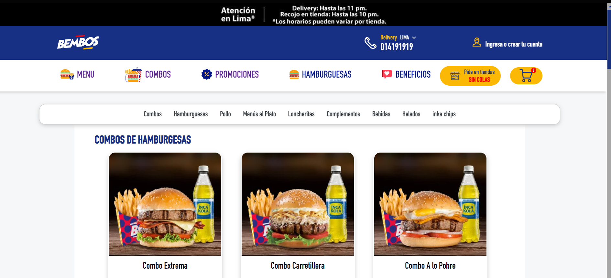
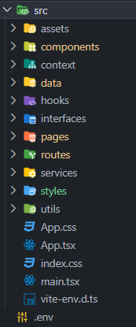
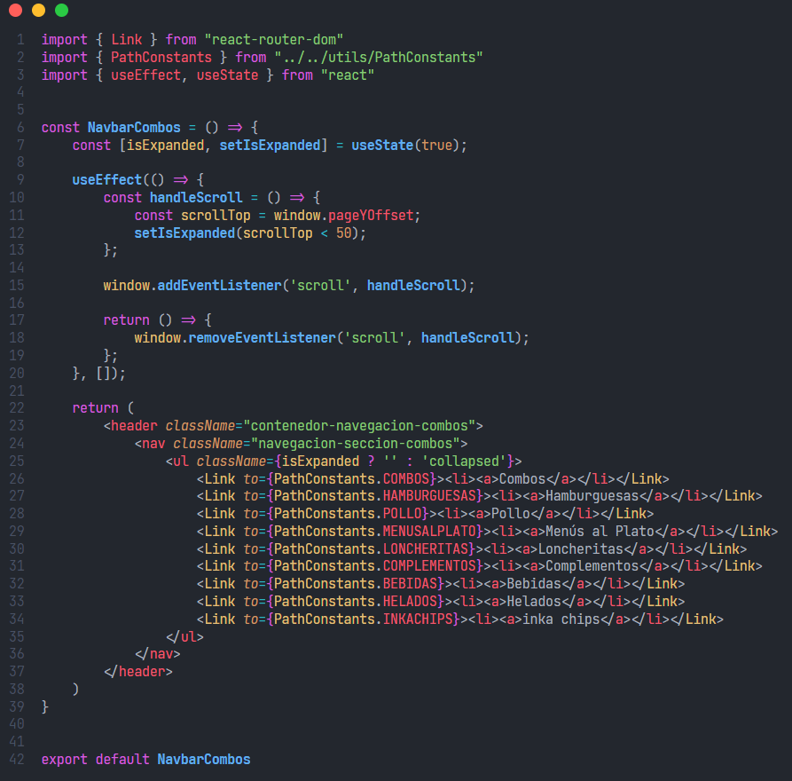

# Proyecto Idat Bembos


## Instalación 💻

**Clonar repositorio**
```bash
git clone https://github.com/RFMC22/proyecto-final-idat
```
**Instalar paquetes**:
con el comando `npm i`, `npm install`, `yarn install` son los mismos.
```bash
npm i
npm install
yarn install
```
**Levantar el front**:
utilizar el comando:
```bash
npm run dev
yarn dev
```
**Levantar el json server**:
utilizar el comando:
```bash
npm run fakeData
yarn fakeData
```

##  Tecnologias utilizadas 🔧
* React
* React Router DOM
* Vite
* HTML5
* CSS3
* TypeScript
* Axios
* Swiperjs
* GitFlow
* Metodologia agil
* BEM
* Firestore
* SweetAlert2
* React Hook Form
* Json Server

##  Estructura de carpeta y archivos 🔧


